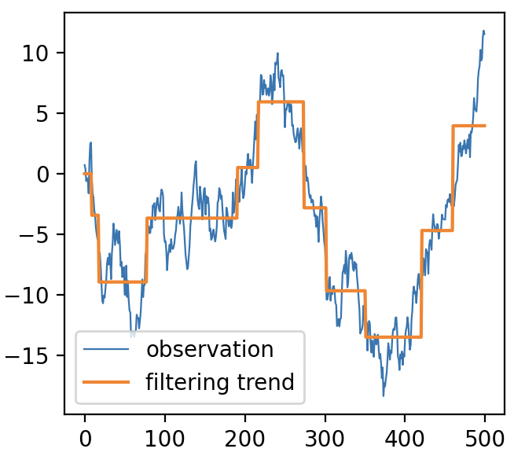

[](https://codecov.io/gh/abess-team/scope)

# ``skscope``: Fast Sparse-Constraint Optimization

## What is `skscope`?

``skscope`` aims to make sparsity-constrained optimization (SCO) is accessible to **everyone** because SCO holds immense potential across various domains, including machine learning, statistics, and signal processing. By providing a user-friendly interface, ``skscope`` empowers individuals from diverse backgrounds to harness the power of SCO and unlock its broad range of applications (see examples exhibited below).


## Installation

The recommended option for most of users:
  
```bash
pip install skscope
```

If you want to work with the latest development version, the further [installation instructions](skscope.readthedocs.io/userguide/install.html) help you install from source.

## Quick examples

Here's a quick example showcasing how you can use three simple steps to perform feature selection via the ``skscope``:

```python
from skscope import ScopeSolver
from sklearn.datasets import make_regression
import jax.numpy as jnp

## generate data
x, y, coef = make_regression(n_features=10, n_informative=3, coef=True)

## 1. define loss function
def ols_loss(para):
    return jnp.sum(jnp.square(y - x @ para))

## 2. initialize the solver where 10 parameters in total and three of which are sparse
solver = ScopeSolver(10, 3) 

## 3. use the solver to optimized the objective
params = solver.solve(ols_loss) 
```

Below's another example illustrates that you can modify objective function to address another totally different problem. 

```python
import numpy as np
import jax.numpy as jnp
import matplotlib.pyplot as plt
from skscope import ScopeSolver

## generate data
np.random.seed(2023)
x = np.cumsum(np.random.randn(500)) # random walk with normal increment

## 1. define loss function
def tf_objective(params):
    return jnp.sum(jnp.square(x - jnp.cumsum(params)))  

## 2. initialize the solver where 10 parameters in total and three of which are sparse
solver = ScopeSolver(len(x), 10)

## 3. use the solver to optimized the objective
params = solver.solve(tf_objective)

tf_x = jnp.cumsum(params)
plt.plot(x, label='observation', linewidth=0.8)
plt.plot(tf_x, label='filtering trend')
plt.legend(); plt.show()
```

<p align="center">

</p>

The above Figure shows that the solution of ``ScopeSolver`` now capture the main trend of the observed random work. Again, 4 lines of code help us attain the solution. 

## Example gallery

Since ``skscope`` can easily be applied to diverse objective functions, we can definitely leverage it to develop various machine learning methods that is driven by SCO. In our example gallery, we supply 25 comprehensive statistical/machine learning examples to illustrate the versatility of ``skscope``. 

## Why ``skscope`` is versatile?

The high versatility of ``skscope`` in effectively addressing SCO problems are derived from two key factors: theoretical concepts and computational implementation. In terms of theoretical concepts, there have been remarkable advancements on SCO in recent years, offering a range of efficient iterative methods for solving SCO. Some of these algorithms exhibit elegance by only relying on the current parameters and gradients for the iteration process. On the other hand, significant progress has been made in automatic differentiation, a fundamental component of deep learning algorithms that plays a vital role in computing gradients. By ingeniously combining these two important advancements, ``skscope`` emerges as the pioneering tool capable of handling diverse sparse optimization tasks.

With ``skscope``, the creation of new machine learning methods becomes effortless, leading to the advancement of the "sparsity idea" in machine learning. This, in turn, facilitates the availability of a broader spectrum of machine learning algorithms for tackling real-world problems.

## Software features

- Support multiple state-of-the-art SCO solvers. Now, ``skscope`` has supported these algorithm: SCOPE, HTP, Grasp, IHT, OMP, FoBa. 

- User-friendly API
  
  - zero-knowledge of SCO solvers: the state-of-the-art solvers in ``skscope`` has intuitive and highly unified APIs. 
  
  - extensive documentation: ``skscope`` is fully documented and accompanied with example gallery and reproduction scripts.

- Solving SCO and its generalization: 
  
  - SCO: $\arg\min\limits_{\theta \in R^p} f(\theta) \text{ s.t. } ||\theta||_0 \leq s$; 
  
  - SCO for group-structure parameters: $\arg\min\limits_{\theta \in R^p} f(\theta) \text{ s.t. } I(||\theta_{{G}_i}||_2 \neq 0) \leq s$ where $\{{G}_i\}_{i=1}^q$ is a non-overlapping partition for $\{1, \ldots, p\}$;
  
  - SCO when pre-selecting parameters in set $\mathcal{P}$: $\arg\min\limits_{\theta \in R^p} f(\theta) \text{ s.t. } ||\theta_{\mathcal{P}^c}||_0 \leq s$. 

- Data science toolkit
  
  - Information criterion and cross validation for selecting $s$
  
  - Portable interface for developing new machine learning methods

- Just-in-time-compilation compatibility

## Benchmark

- Support recovery accuracy

| Methods      | Linear regression | Logistic regression | Trend filtering | Multi-task learning | Ising model | Nonlinear feature selection |
| ------------ | ----------------- | ------------------- | --------------- | ------------------- | ----------- | --------------------------- |
| `OMPSolver`   | 1.00(0.01)        | 0.91(0.05)          | 0.70(0.18)      | 1.00(0.00)          | 0.98(0.03)  | 0.77(0.09)                  |
| `IHTSolver`   | 0.79(0.04)        | 0.97(0.03)          | 0.08(0.10)      | 0.97(0.02)          | 0.96(0.05)  | 0.78(0.09)                  |
| `HTPSolver`   | 1.00(0.00)        | 0.84(0.05)          | 0.41(0.22)      | 1.00(0.00)          | 0.97(0.03)  | 0.78(0.09)                  |
| `GraspSolver` | 1.00(0.00)        | 0.90(0.08)          | 0.58(0.23)      | 1.00(0.00)          | 0.99(0.01)  | 0.78(0.08)                  |
| `FoBaSolver`  | 1.00(0.00)        | 0.92(0.06)          | 0.87(0.13)      | 1.00(0.00)          | 1.00(0.01)  | 0.77(0.09)                  |
| `ScopeSolver` | 1.00(0.00)        | 0.94(0.04)          | 0.79(0.19)      | 1.00(0.00)          | 1.00(0.01)  | 0.77(0.09)                  |
| `cvxpy`       | 0.83(0.17)        | 0.83(0.05)          | 0.19(0.22)      | 1.00(0.00)          | 0.94(0.04)  | 0.74(0.09)                  |

All solvers (except `IHTSolver`) in `skscope` consistently outperformed `cvxpy` in terms of accuracy for the selection of the support set. 

- Runtime (measured in second):

| Methods      | Linear regression | Logistic regression | Trend filtering | Multi-task learning | Ising model  | Nonlinear feature selection |
| ------------ | ----------------- | ------------------- | --------------- | ------------------- | ------------ | --------------------------- |
| `OMPSolver`   | 0.62(0.11)        | 0.80(0.11)          | 0.03(0.00)      | 2.70(0.26)          | 1.39(0.13)   | 13.24(3.91)                 |
| `IHTSolver`   | 0.23(0.05)        | 0.18(0.12)          | 0.30(0.06)      | 0.80(0.11)          | 0.98(0.08)   | 1.67(0.50)                  |
| `HTPSolver`   | 0.50(0.14)        | 0.94(0.44)          | 0.03(0.01)      | 14.18(5.13)         | 3.41(1.22)   | 12.97(6.23)                 |
| `GraspSolver` | 0.18(0.06)        | 2.55(0.86)          | 0.08(0.03)      | 0.54(0.28)          | 0.53(0.22)   | 3.06(0.75)                  |
| `FoBaSolver`  | 3.71(0.50)        | 3.28(0.39)          | 0.13(0.02)      | 6.22(0.61)          | 11.10(1.04)  | 57.42(12.95)                |
| `ScopeSolver` | 0.30(0.08)        | 1.20(2.14)          | 0.09(0.01)      | 1.14(0.89)          | 1.17(0.25)   | 7.78(2.23)                  |
| `cvxpy`       | 14.59(5.60)       | 69.45(53.47)        | 0.47(0.16)      | 39.36(155.70)       | 32.26(17.88) | 534.49(337.72)              |

`skscope` demonstrated significant computational advantages over `cvxpy`, exhibiting speedups ranging from approximately 3-500 times.


## Contributions

Any kind of contribution to `skscope` would be highly appreciated! Please check the [contributor's guide](skscope.readthedocs.io/contribute/index.html).

- Bug report via [github issues](https://github.com/abess-team/skscope/issues)