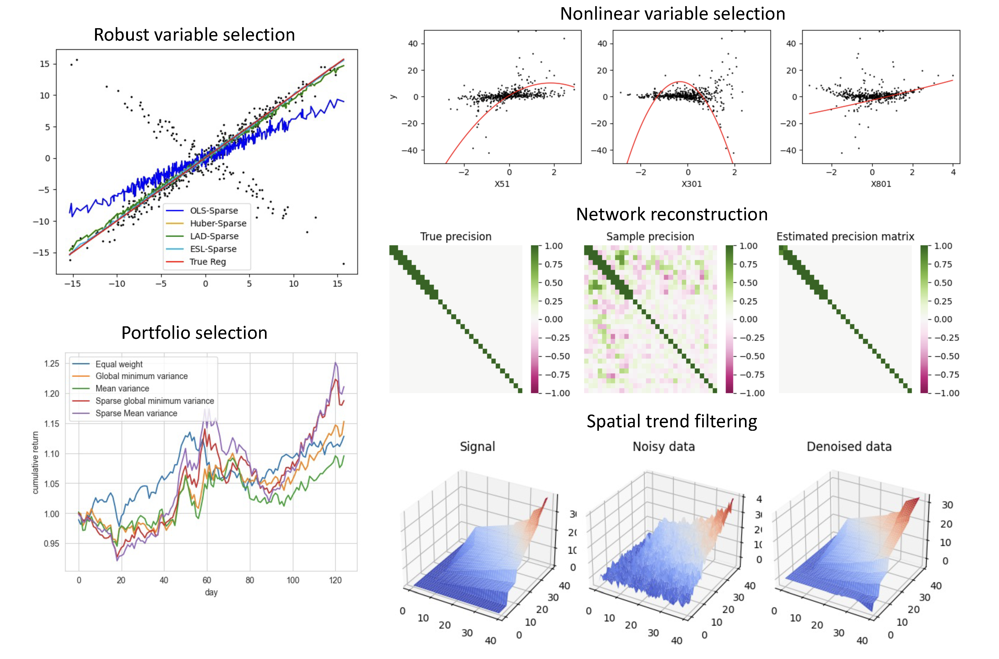

.. _skscope_package:

``skscope``: Fast Sparse-Constraint Optimization
==============================================================

``skscope`` aims to make sparsity-constrained optimization (SCO) accessible to everyone because SCO holds immense potential across various domains, including machine learning, statistics, and signal processing. By providing a user-friendly interface, ``skscope`` empowers individuals from diverse backgrounds to harness the power of SCO and unlock its broad range of applications (see examples exhibited below).

.. grid:: 1 2 2 3
   :gutter: 1

   .. grid-item-card::
      :link: userguide/install.html

      :fas:`download;pst-color-primary` **Installation**
      ^^^

      The simplest way to install ``skscope`` is running ``pip install skscope``. Alternatively, you can install ``skscope`` from source following this instruction in the `installation guide <./userguide/install.html>`_.

   .. grid-item-card::
      :link: userguide/quickstart.html

      :fas:`bolt;pst-color-primary` **Quick Start**
      ^^^
      
      The quick example demonstrates the basic usage of ``skscope``, which is remarkably straightforward. All you need is programming an objective function.

   .. grid-item-card::
      :link: feature/index.html

      :fas:`palette;pst-color-primary` **Software Features**
      ^^^
      Introduce the advanced features provided by ``skscope``, including the implemented iterative algorithms, practical helpful variants, toolkits for data science, and tips for improving computational efficiency.

   .. grid-item-card::
      :link: gallery/index.html

      :fas:`list;pst-color-primary` **Examples Gallery**
      ^^^
      Comprehensive and hands-on examples that covers various machine learnings problems including regression analysis, survival analysis, graphical model, trend filtering, finance data analysis, and more. 

   .. grid-item-card::
      :link: autoapi/index.html

      :fas:`file;pst-color-primary` **API Reference**
      ^^^
      The reference guide of ``skscope`` provides a detailed description of the API. It offers information about the available classes and functions, along with their respective parameters.

   .. grid-item-card::
      :link: contribute/index.html

      :fas:`terminal;pst-color-primary` **Contributor's Guide**
      ^^^
      Spot a typo in the documentation? Want to add new functionalities? Meet a bug? The contributing guide is here to assist you in addressing these issues.

.. toctree::
   :maxdepth: 1
   :hidden:

   userguide/index

.. toctree::
   :maxdepth: 1
   :hidden:

   feature/index
   

.. toctree::
   :maxdepth: 1
   :hidden:

   gallery/index

.. toctree::
   :maxdepth: 1
   :hidden:

   autoapi/index

.. toctree::
   :maxdepth: 1
   :hidden:

   contribute/index

.. toctree::
   :maxdepth: 1
   :hidden:

   more/frequentaskedquestions

.. toctree::
   :maxdepth: 1
   :hidden:

   more/benchmark
