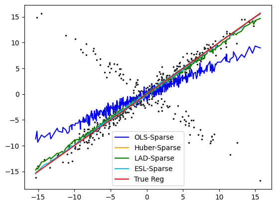
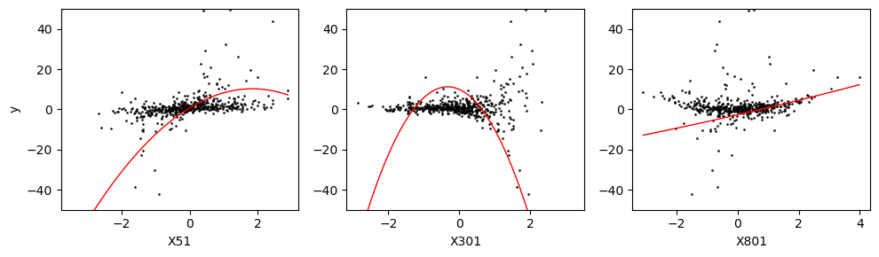
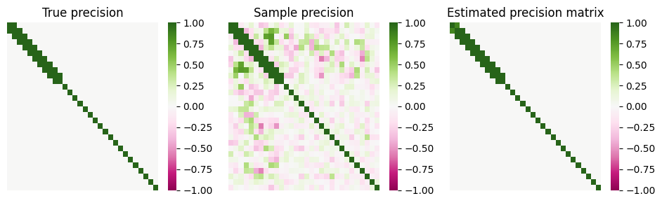
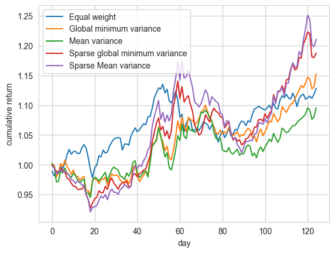

:parenttoc: True

What is ``skscope``?
=====================================

``skscope`` is a powerful open-source Python package specifically developed to tackle sparsity-constrained optimization (SCO) problems with utmost efficiency. With SCO's broad applicability in machine learning, statistics, signal processing, and other related domains, ``skscope`` can find extensive usage in these fields. For example, it excels in solving classic SCO problems like variable selection (also known as feature selection or compress sensing). Even more impressively, it goes beyond that and handles a diverse range of intriguing real-world problems:

1. `Robust variable selection <gallery/LinearModelAndVariants/robust-regression.html>`__

2. `Nonlinear variable selection <gallery/Miscellaneous/hsic-splicing.html>`__

3. `Spatial trend filtering <gallery/FusionModels/spatial-trend-filtering.html>`__

.. image:: figure/trend_filter.png
  :width: 666
  :align: center

4. `Network reconstruction <gallery/GraphicalModels/sparse-gaussian-precision.html>`__

5. `Portfolio selection <gallery/Miscellaneous/portfolio-selection.html>`__

These above examples represent just a glimpse of the practical problems that ``skscope`` can effectively address. With its efficient optimization algorithms and versatility, ``skscope`` proves to be an invaluable tool for a wide range of disciplines. Currently, we offer over 20 examples in our comprehensive `example gallery <gallery/index.html>`__.

.. How does ``skscope`` work? 
.. --------------------------

.. The high versatility of ``skscope`` in effectively addressing SCO problems are derived from two key factors: theoretical concepts and computational implementation. In terms of theoretical concepts, there have been remarkable advancements on SCO in recent years, offering a range of efficient iterative methods for solving SCO. Some of these algorithms exhibit elegance by only relying on the current parameters and gradients for the iteration process. On the other hand, significant progress has been made in automatic differentiation, a fundamental component of deep learning algorithms that plays a vital role in computing gradients. By ingeniously combining these two important advancements, ``skscope`` emerges as the pioneering tool capable of handling diverse sparse optimization tasks.

.. With ``skscope``, the creation of new machine learning methods becomes effortless, leading to the advancement of the "sparsity idea" in machine learning. This, in turn, facilitates the availability of a broader spectrum of machine learning algorithms for tackling real-world problems.